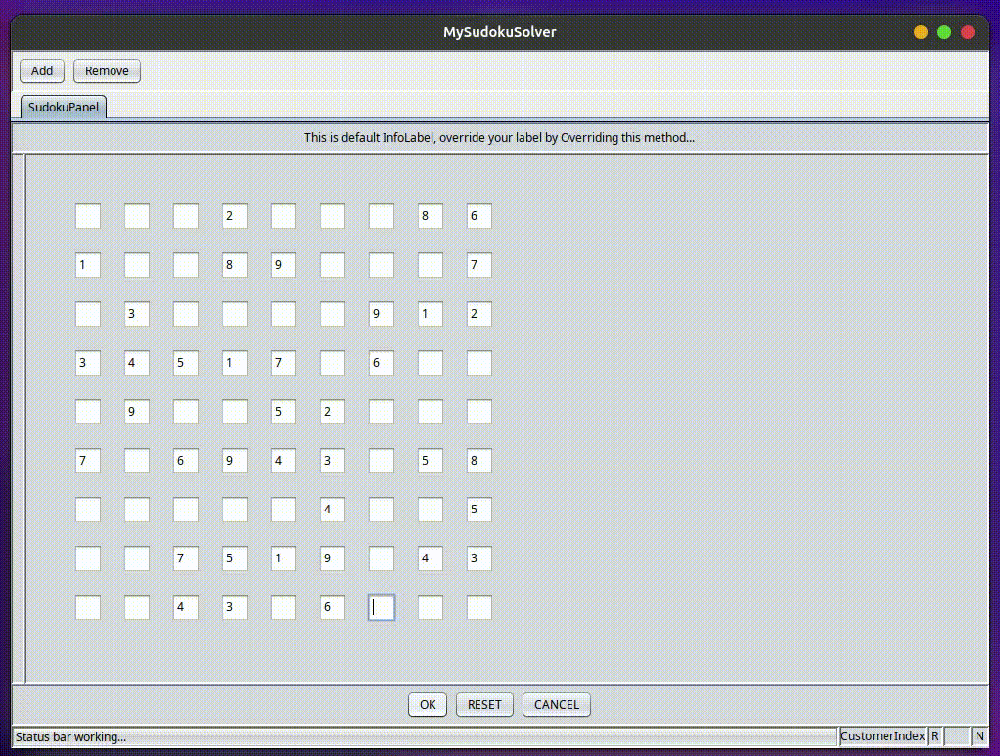

# Sudoku Solver

### Run 
- Run `MySudokuSolver` class from `io.games.swings.application` package to launch sudoku-solver
- Input the values manually for the puzzle
- Click `OK` button from the panel to start execution

### Demo

